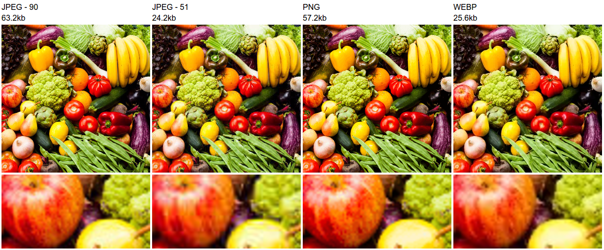
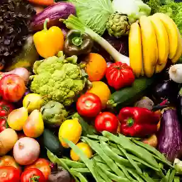

# Optimizing Images for the web

As much progress as the web has had in the past few years, we still have fragmented browser support for optimized image formats.

These newer image formats generally offer a better compression than JPG and take advantage of better mathematical encoding, prediction logic and dynamic color palettes (See [here](https://blogs.akamai.com/2013/11/extreme-image-optimization-webp-jpeg-xr-in-aqua-ion.html)).

WebP only works on Chrome and Opera; JXR on IE9+ and Edge. How do we automate generation and serving of these files?

## Overview

The goal is to reduce the total number of bytes sent per image while retaining enough [structural similarity](https://en.wikipedia.org/wiki/Structural_similarity) to prevent any perceivable quality degradation.

To do that, we will optimize existing formats and take advantage of new ones when available.



## Packages

For optimizing PNGs we will use [pngquant](https://packages.debian.org/jessie/pngquant) since it offers [excellent compression](http://pointlessramblings.com/posts/pngquant_vs_pngcrush_vs_optipng_vs_pngnq/) while minimally sacrificing quality.

For JPGs we can use Mozilla's [mozjpeg](https://github.com/mozilla/mozjpeg) project which generally leads to [better results](https://blarg.co.uk/blog/comparison-of-jpeg-lossless-compression-tools) albeit performance is slower than alternatives like [jpegoptim](https://github.com/tjko/jpegoptim) or [jpegtran](https://github.com/papandreou/node-jpegtran).

And then for webp and jxr there is Google's [webp](https://developers.google.com/speed/webp/) package and [JxrEncApp](http://manpages.ubuntu.com/manpages/wily/man1/JxrEncApp.1.html), respectively.

Finally, to asses SSIM similarity we'll use a [script](http://www.fmwconcepts.com/imagemagick/ssim/index.php) that relies on [image magick](https://www.imagemagick.org/script/index.php). I've included a copy of the file under `scripts/ssim.sh`.

## Install

Let's set up our environment so that we can generate webp, jxr and optimize jpg and pngs.


```bash
#!/bin/bash

sudo apt-get update

# WebP dependencies
sudo apt-get install libjpeg-dev libpng-dev libtiff-dev libgif-dev webp

# JXR support
sudo apt-get install libjxr-tools

# mozjpeg
sudo apt-get install autoconf automake libtool nasm make
wget https://github.com/mozilla/mozjpeg/releases/download/v3.1/mozjpeg-3.1-release-source.tar.gz
tar -xvf mozjpeg-3.1-release-source.tar.gz
cd mozjpeg
autoreconf -fiv
mkdir build && cd build
sh ../configure
sudo make install

# Make /opt/mozjpeg/bin/jpegtran available to the path as mozjpeg
sudo ln -s /opt/mozjpeg/bin/jpegtran /usr/local/bin/mozjpeg

# Install pngquant
sudo apt-get install pngquant

# Install ImageMagick
sudo apt-get install imagemagick
```

To reproduce these steps you will need to checkout [this repo](github.com/obartra/notes) and `cd` to the `imageOptimization` folder.

## WebP

Let's say we receive `assets/input.jpg` to optimize. It's a JPEG image saved at already a decently small file size (63.2kb).


For Blink browsers (Chrome, Opera), we want to serve `*.webp` so we run:

```bash
cwebp assets/input.jpg -q 80 -o assets/output-q80.webp
```

That generates a 31.2kb image (about ~2x smaller). How do we know if it's noticeably different from the input? We want to be able to generate these images programatically so we don't want to manually verify each one of them. Here is where SSIM comes in:

```
./scripts/ssim.sh assets/input.jpg assets/output-q80.webp
```

At around 95% SSIM differences are not discernable by most people (See [JR. Flynn et al, 2013](https://www.semanticscholar.org/paper/Image-Quality-Assessment-Using-the-SSIM-and-the-Flynn-Ward/056e28a107a2ff32114a24b7ec33dc6b18752766/pdf) for more info). The exact SSIM value at which two images are different depends on the person, the image, distance from the screen, lighting... so 95% is not a guarantee, but it should be good enough for most purposes.

If we wanted a higher compression we can just change the quality parameter. For instance `-q 65` leads to a SSIM of 93% and a file size of 24.1kb

| Quality | WebP 80 | WebP 65 | WebP 10 |
|---|---|---|---|
| Image | |  |  |
| Size | 31.2kb | 24.1kb | 9.6kb |
| SSIM | 95% | 93% | 88% |

## JXR

The process for JXR is similar to that of WebP but the input formats are restricted to bmp, tif, hdr 😡.

We already have `imagemagick` installed so we can leverage it to generate the file. Since `.bmp` is lossless there shouldn't be a concern for degradation. Let's try it:

```bash
convert assets/input.jpg assets/intermediate.bmp
JxrEncApp -i assets/intermediate.bmp -o assets/output-q65.jxr -q 0.65
rm assets/intermediate.bmp
```

Similarly, we can also play with the quality setting to modify the SSIM and file size.

| Quality | JXR 80 | JXR 65 | JXR 10 |
|---|---|---|---|
| Image | |  |  |
| Size | 87.0kb | 66.8kb | 17.0kb |
| SSIM | 96% | 95% | 90% |

## Optimize Standards

Ok, so what happens when someone visits our site and they are not using IE, Edge, Chrome or Opera? Maybe they are on Firefox or Safari or some other browser. We need to optimize for these cases as well.

For that same `assets/input.jpg` we would do:

```bash
mozjpeg -optimize assets/input.jpg > assets/output.jpg
```

In this case our input image was already an optimized jpeg and `mozjpeg` wasn't able to obtain any additional gains. That happens some times. On occasion a `jxr` or a `webp` file will even be larger than the input `jpeg`.

These should be edge cases but we need to account for those so that we don't end up serving larger files.

Finally, if the input image was a `*.png` we would optimize it like:

```
pngquant --speed=1 assets/input.png -o assets/output.png
```

That output has a SSIM of 94% and a file size of 64.8kb (x3 smaller than the input png).

| Quality | Unoptimized PNG | Optimized PNG |
|---|---|---|---|
| Image | |  |
| Size | 206.1kb | 64.8kb |
| SSIM | N/A | 94% |

## Serving Images

We've started with a single `assets/input.jpg`. At this point we should have an optimized version of the `jpg` file, a `webp` one and `jxr` one.


### Front End Solutions

There are several potential approaches. If we need to support an image-heavy application that would benefit from the the webp optimizations, it may be worth [polyfilling browser WebP support](https://webpjs.appspot.com/) and only serve that format.

We could also use a library like [Modernizr](https://modernizr.com/) to detect [WebP support](https://modernizr.com/download?setclasses&q=webp). Our code would look something like this:

```javascript
const img = document.querySelector('.myImg');
Modernizr.on('webp', supportsWebP => {
	if (supportsWebP) {
		img.src = img.src.replace(/.jpg$/, '.webp');
	}
});
```

This approach gets messy quickly too. So a simpler alternative may be to solve this server side.

### Back End Solutions

When we send a `GET` or a `HEAD` request for a URL we are already sending information on the supported file types for our current browser. This allows us to seamlessly re-write paths.

If you are using [express](https://github.com/expressjs/express) or [Connect](https://github.com/senchalabs/connect/) you may want to check out [webp-jxr-middleware](https://github.com/obartra/webp-jxr-middleware) that does just that.
